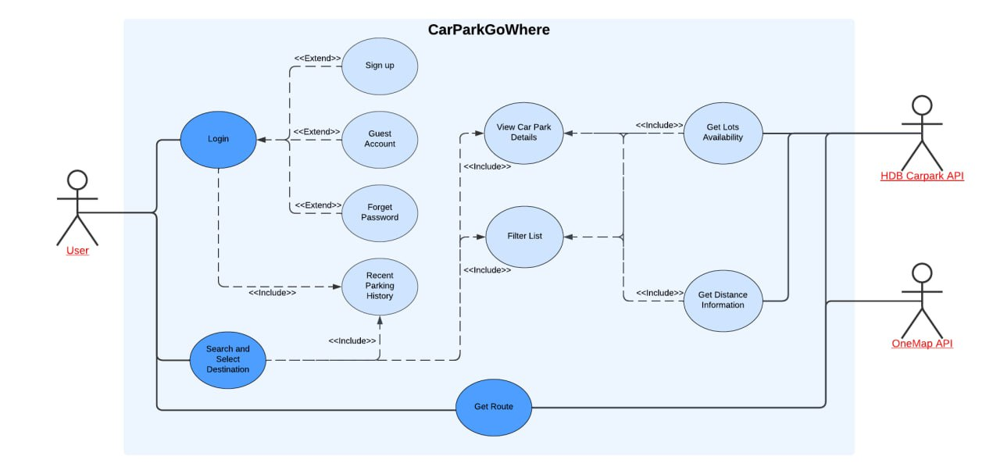

# CarParkGoWhere

Welcome to to the repository for NTU SC2006 Software Engineering Team 46 group project - CarParkGoWhere.


With high vehicle ownership numbers in Singapore, we face a significant parking problem, particularly in densely populated areas such as the Central Business District area and even at typical HDB car parks after working hours. 

With CarParkGoWhere, we are aiming to reduce the hassle of having to drive around and search for a free parking space near your destination.

# Table of Contents
- [CarParkGoWhere](#carparkgowhere)
- [Table of Contents](#table-of-contents)
- [Setup Instructions](#setup-instructions)
	- [Front-end](#front-end)
	- [Backend](#backend)
	- [Setting up the code to point to the database](#setting-up-the-code-to-point-to-the-database)
- [Demo](#Demo-of-App)
- [App Design](#app-design)
	- [Overview](#overview)
	- [Front End](#front-end-1)
	- [Back End](#back-end)
	- [Design Pattern](#design-pattern)
	- [Tech Stack](#tech-stack)
		- [Front End](#front-end-2)
		- [Back End](#back-end-1)
	- [External APIs Used](#external-apis-used)
	- [Contributors](#contributors)

# Setup Instructions

### Front-end
1. Install node.js
2. Install the required modules
	```
	npm install bcrypt buffer-crc32 connect-mongo cookie-parser debug ejs express express-flash express-session method-override mongodb mongoose nodemailer otp-generator passport passport-local proj4 uid2 dotenv nodemon
	```
And you are done for frontend.

### Backend
1. Download and install MongoDB [here](https://www.mongodb.com/try/download/community)
2. Read up on how to set up a MongoDB server [here](https://medium.com/@almusawihashim/a-production-guide-on-self-hosting-mongodb-573969732eaa)
3. Open MongoDB Compass
4. Create a database. Give it any name.
5. Create 2 collections called "userdatas" and "userhistories" and import the respective JSON files from the `Database CSVs` folder. 
**IMPORTANT:** You have to follow these namess exactly or you will have to modify the names in the code.
6. Take note of the database name. You will need this. See [here](#setting-up-the-code-to-point-to-the-database)

#### Setting up the code to point to the database
1. Open [Database.js](#SC2006%20Project/BoundaryClasses/Database.js) in `/BoundaryClasses`.
2. Look for this code:
	```javascript
	const LOCAL_CONNECTION = '' //Insert your local connection string here
	```

3. Replace with 'mongodb://localhost:27017/(databaseName)', databaseName being the one you created just now.
   Example:
	```javascript
	const LOCAL_CONNECTION = 'mongodb://localhost:27017/CarParkGoWhere' //Insert your local connection string here
	```
4. Save and restart the server.

# Demo of App


# App Design
### Overview


### Front End
For our front end, we mainly used Express JS to wrap javascript into HTML. We separted the pages that the user will view into guest.ejs, index.ejs, forgetPassword.ejs, register.ejs, resetPassword.ejs and sucessResetPassword.ejs. All of these can be found under `/views`

Other folders such as `\public` contains the codes and styles used for the User Interfaces and design of the pages.

### Back End

`📁\BoundaryClasses` - contains the code files for Javascript Routes

`📁\Control_Classes` - contains the code files for navigation, search and user page functions

`📁\models` - contains the schema used for MongoDB database.

`📁\routes` - contains the code for map routing

`📁\server.js` - main application script. Call `node server` in terminal while in project folder to start the web server.

### Design Pattern

For our application, we used MVC ( Model - View - Controller).

`Model` - MongoDB database

`View` - Webpages (or .ejs files)

`Controller` - Javascript in both`📁\Control_Classes` and `📁\BoundaryClasses` are responsible for the logic

### Tech Stack
#### Front End
- Express.js
- HTML
- CSS

#### Back End
- Node.js
- MongoDB


## External APIs Used
- OneMap Singapore - [LINK](https://www.onemap.gov.sg/apidocs/)
- HDB - [LINK](https://data.gov.sg/collections/148/view)


## Contributors
The following people have contributed to the whole project, including (non-exhuastive):

1) Ideation and refinement
2) Functional and non-functional requirements
3) Use cases and diagrams
4) UI Mockups and prototyping
5) Development of application
6) Testing
7) Documentations

| Name           | Role           | GitHub Profile                          |
|----------------|----------------|-----------------------------------------|
| Haoren       |  Backend (Map Logic)    | [lcx21](https://github.com/Icx21)   |
| Yi Feng    | Backend (API Logic)     | [chengyf5566 ](https://github.com/chengyf5566) |
| Darren  | Backend (Database, Accounts)| [Dlhwai](https://github.com/Dlhwai) |
| Jing Jie  | Backend (Search Logic)| [jingjieong](https://github.com/jingjieong) |
| Jing Woon  | Frontend (UI, filtering)| [jwistired](https://github.com/jswistird) |
| Jumanaa  | Frontend (UI, filtering)| [Jumanahaseen03](https://github.com/Jumanahaseen03) |
